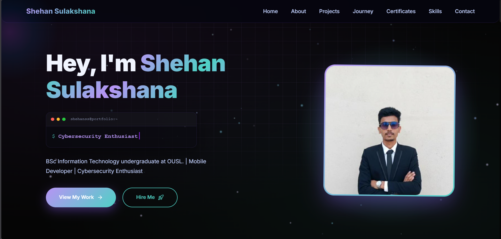

  <h2>
    
    &nbsp;--- Portfolio ---&nbsp;
    
  </h2>

### Shehan Sulakshana : Mobile Developer & Cyber Security Enthusiast

**A personal portfolio showcasing live projects, a learning journey, and a growing skillset in Cyber Security and Flutter development.**

[**🌐 View Live Site**](https://shehan-sulakshana.is-a.dev) · [**📩 Contact**](#-contact)

 

  

 

---

## 👋 About Me

I'm a BSc IT undergraduate with hands-on experience in mobile app development, building cross-platform applications using Flutter and writing efficient code in Python and Java. Alongside development, I'm growing my expertise in cybersecurity, building a strong foundation in security fundamentals and preparing for industry certifications.

This portfolio serves as my online presence, a space where I document my projects, track my learning journey, and share the skills I'm building along the way.

---

## 📱 Sections

| Section | Description |
|---|---|
| 🏠 **Home** | Hero introduction |
| 💻 **Projects** | Active security & development work |
| 🗺️ **Journey** | Learning milestones and timeline |
| 🎓 **Certifications** | Industry certifications earned & in progress |
| 🛠️ **Skills** | Tools & technologies |
| 📩 **Contact** | Social links & ways to connect |

---

## 🎨 Tech Stack

---

### 🕒 Tracking my Cyber Security + Flutter journey since **January 2025**

